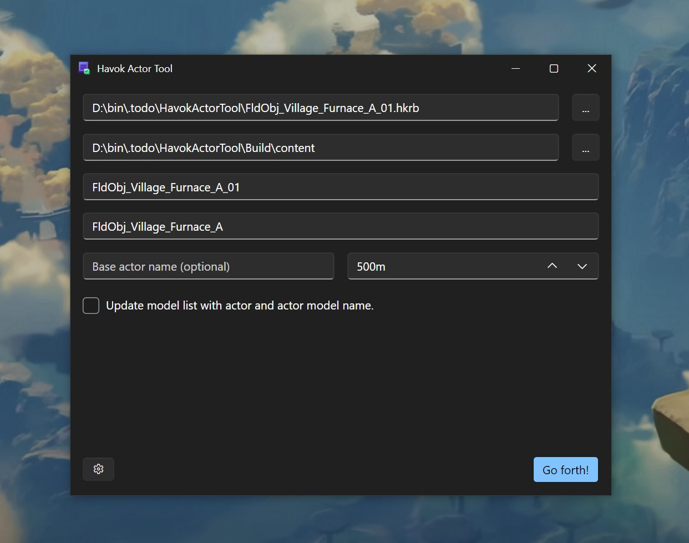

# Havok Actor Tool

[](https://github.com/ArchLeaders/HavokActorTool/blob/master/License.md) [](https://github.com/ArchLeaders/HavokActorTool/releases)

Simple tool for creating actors with appended collision rigid body files (HKRB).



## CLI Usage

```
HavokActorTool.exe [arguments...] [options...] [-h|--help] [--version]
```

### Arguments

  - <ins>[string]</ins> | The absolute path to the input HKRB (havok rigid-body) file.`

### Options

  - `--output-mod` <ins>[string?]</ins>
    - The absolute path to the output mod folder. (Default: null)
  - `--actor-name` <ins>[string?]</ins>
    - The name of the actor to create. (Default: null)
  - `--model-name` <ins>[string?]</ins>
    - The actor bfres name. (Default: null)
  - `--base-actor-name` <ins>[string?]</ins>
    - The name of the vanilla actor to base the new actor on. (Default: null)
  - `--use-custom-model`
    - Update the actor info and model list to use the specified actor and model name. (Optional)
  - `--life-condition` <ins>[float]</ins>
    - The life condition distance in meters. (Default: 500)

## Special thanks to,

- **GingerAvalanche**: ActorInfo help, BYML library.
- **KillzXGaming**: Library help and creation.
- **Nivium**: Debugging and early testing.
